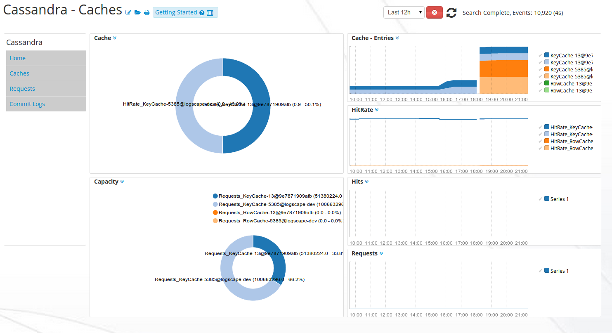
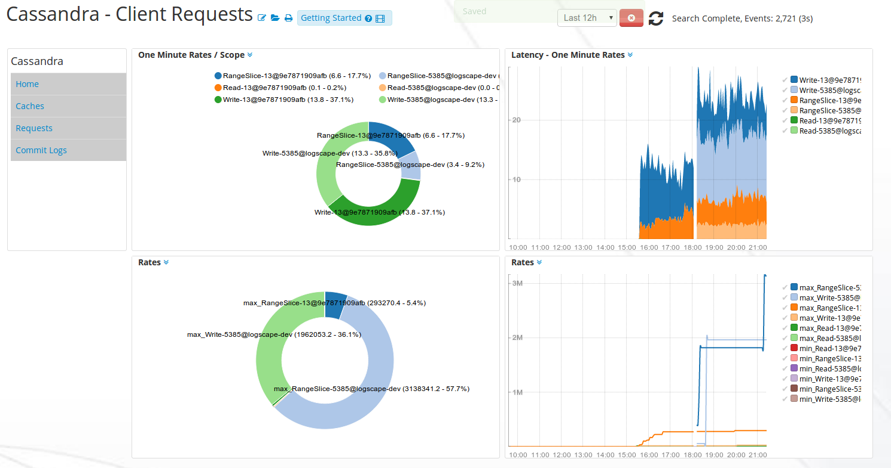
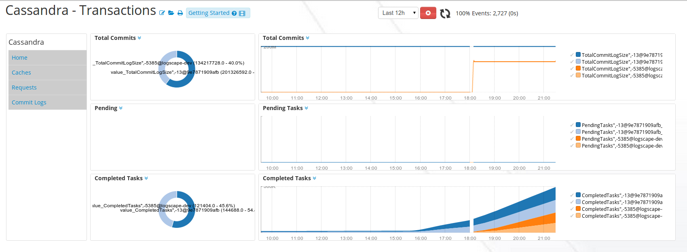

# CassandraApp-1.0

# Intro 

Monitor a Apache Cassandra cluster, get insights on your heap memory usage, transactions and cache hit rates. 

## Downloads 

 * [CassandraApp-1.0.zip](https://github.com/logscape/cassandraapp/raw/master/CassandraApp-1.0.zip)
 * [CassandraApp-1.0-override.properties](https://github.com/logscape/cassandraapp/raw/master/CassandraApp-1.0-override.properties) 

## Configure 

 Download the sample override file and replace hosts with the members from your Cassandra cluster 

## Caches 
 

## Client Requests 
 

## Transactions 

 

